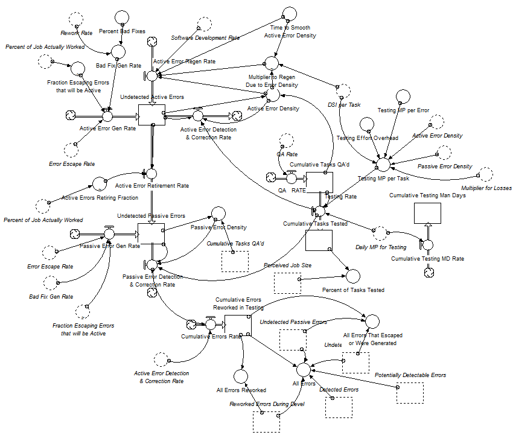
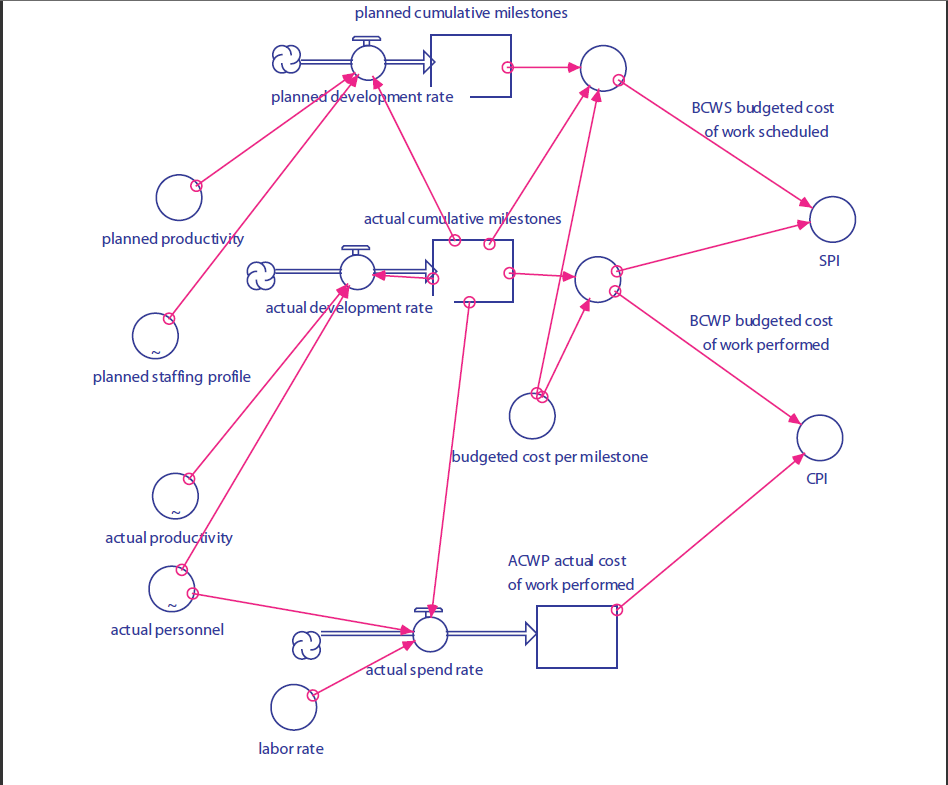
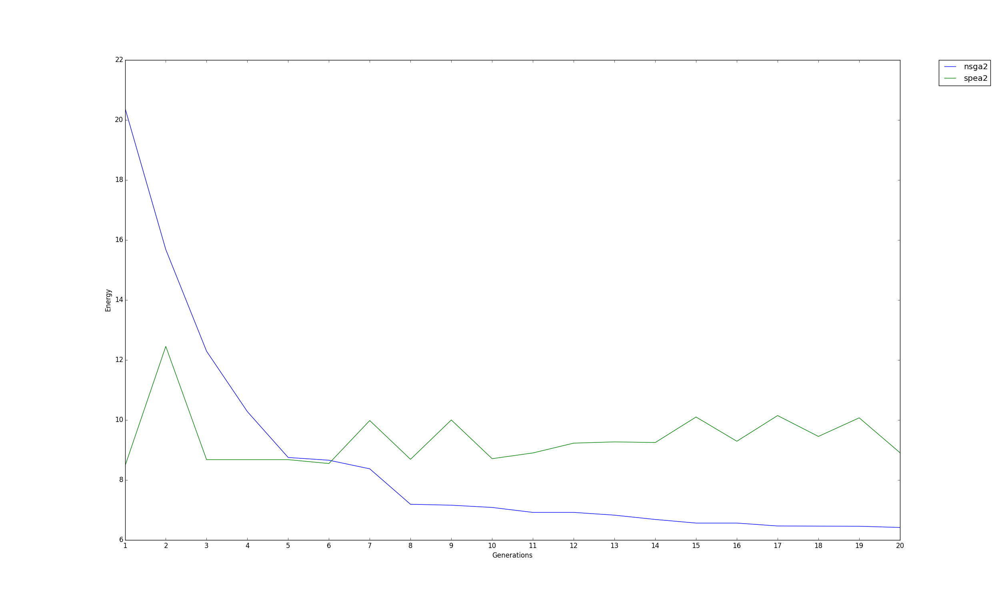
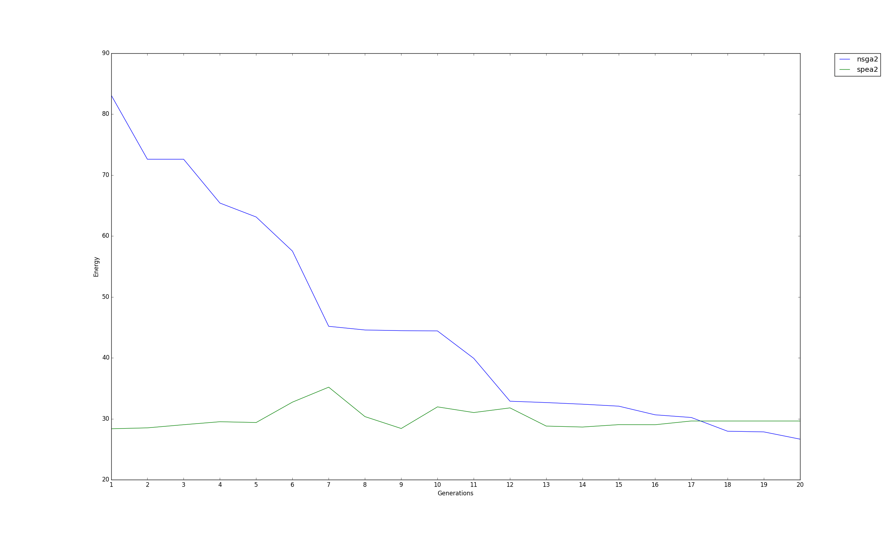

# Analysis of Earned Value Model and Integrated Project Model Defect Testing Flow

## ABSTRACT
Any product development has various stages to complete the product development cycle. Each team that is part of development has some requirements and guidelines to work with. Two important stages are Testing and Development costs. Testing team spends a lot of time finding errors, and fixing the errors that have been generated as part of the development process. The other import aspect of a product development is its low cost and tight schedule to conlcude the porject in time.
Software models are used to illustrate and predict the resources needed to reduce development errors, and predict estimation rate to reduce development errors can be of great help to software practitioners. Similarly, for the cost cutting and shorter timeline for product development. The goal of this project is to analyze the Integrated Project Model Defect Testing Flow proposed by Abdel-Hamid and Madnick and Earned Value Model, by implementing the model, and optimizing the model using few standard optimizers. Earned Value Model is used best when integrated with the Defect Testing flow Model. In this project, the standard software models are implemented that takes software development effort into account and calculates the amount of development errors, cost, schedule, and tasks with certain assumptions, and considering a subset of the full development resource inputs. To optimize the resources needed to reduce certain efforts, Nondominated sorting genetic algorithm II (NSGA-II) and Strength Pareto Evolutionary Algorithm (SPEA2) standard algorithms are used. The results are compared with both the optimizers used. We observe that a subset of the complete list of development resource inputs is required to provide an optimal solution the software models of interest.

## INTRODUCTION
Software quality means different things to different people. The relative importance of different characteristics or attributes depends on who is assessing the software and what they need or expect from it. Utility can be considered in many ways. Users frequently are concerned about the number and type of failures that occur during usage. Developers are worried about the overall cost and scheduling of the product. The value-based product model addresses the attributes reliability, affordability, and timeliness in a commercial market context. Earned value is a useful approach for tracking performance against plans and controlling a project. Earned value helps you become a “real-time process controller” by tracking and reacting to the project trends. Monitoring cost and schedule performance against plans helps spot potential schedule slippages and cost overruns early in order to minimize their impact. All work is planned, budgeted, and scheduled in time-phased increments constituting a cost and schedule measurement baseline.
To help software practitioners in assessing the costs, schedule and the efforts made to reduce the software defects and optimizing allocation of resources, several models are proposed that can integrate different sectors of the software team such as manpower allocation, testing, and productivity.
The goal of this project is to analyze the Integrated Project Model Defect Testing Flow proposed by Abdel-Hamid and Madnick [1] and Earned Value Model [2], by implementing the model, and optimizing the model using few standard optimizers.

Rest of the report is organized as follows Section II describes necessary background. In Section III we state the assumptions of our project. Section IV illustrates our implementation of the model, and the optimizer. Section V describes the methodology of the project. In Section VI we explain our findings. Section VII discusses the threats to validity for the project. In Section VIII we state the future directions of the project. Finally we conclude our report in Section IX.

## BACKGROUND

NSGA-II [3] multi-objective optimization method comprises the steps of: (1) random initial population as the first generation of the parent population, the number of stocks of size N; (2) the first generation of the parent populations Non-dominated sorting through selection, crossover, after generating a first generation of sub-population variation, then merged into twice the population; (3) twice the combined population of fast non-dominated sorting, first select the first-stage non-dominated individual set N1, D1 discarded at random after several individuals, packed into the next generation of the parent population; (4) in order to select the next ー grade non-dominated individual set Ni (i = 2,3, ......, n), in a random throw -Di After a number of individuals, packed into the next generation of the parent population, until the last ー grade non-dominated individual set Nn. The last non-domination ー level set more than a collection of individual populations remaining filling space next parent; and (5) of the final ー grade non-dominated individual set Nn, random throw in a few individuals -Dn performed after crowding calculations, crowding distance large individual filling into the next generation of the parent population than space; the next generation of the parent population (6) was subjected to selection, crossover and mutation of these genetic manipulation to produce the next generation of sub-populations, Hapjeong generation Sons populations go (3).

SPEA [4] uses a regular population and an archive (external set). Starting with an initial population and an empty archive the following steps are performed per-iteration. First, all nondominated population members are copied to the archive; any dominated individuals or duplicates (regarding the objective values) are removed from the archive during this update operation. If the size of the updated archive exceeds a predefined limit, further archive members are deleted by a clustering technique which preserves the characteristics of the nondominated front. Afterwards, fitness values are assigned to both archive and population members.

Abdel-Hamid and Madnick [5] proposed the integrated defect model that illustrates the interaction between different teams inside a software organization team namely the QA team, testing team, and the personnel allocation sector. Madachy in his book [6] proposed a simplified version of Abdel-Hamid and Madnick’s proposed model and termed it as the Integrated Project Model Defect Testing Flow (IPMDTF). Figure 1 shows IPMDFC. In contrast to the model proposed by Abdel-Hamid and Madnick, the flow chains are simplified. The model considers two types of errors namely active, and passive. According to Madachy, active errors can contribute to other errors, while passive errors do not. Madachy considers all design errors to be active errors, though coding errors may be either active or passive.


Figure 1. Integrated Project Model Defect Testing Flow

Earned value Model is a useful approach for tracking performance against plans and controlling a project. It provides important management indicators but does not have dynamics intrinsic to itself. This section, therefore, focuses on using an earned value simulation model for training and learning. Earned value helps you become a “real-timeprocess controller” by tracking and reacting to the project trends. Monitoring cost and schedule performance against plans helps spot potential schedule slippages and cost overruns early in order to minimize their impact. Figure 2 shows Earned Value Model (EVM).


Figure 2. Earned Value Model.

## ASSUMPTIONS
To implement the model we use the concepts of stock, flow, and auxiliary that are defined below:
 
- A flow is an entity that contributes to a stock over time. There are two types of flows, namely inflows and outflows. Inflows work as an aggregator to a stock, whereas outflows work as a depletory for a stock. Usually, flows are measured for a certain period of time.
- A stock is the entity that aggregates flows over time. Stocks are made larger over time by inflows and decreased by outflows.
- An auxiliary is an entity that is used to hold input values or intermediates. In our implementation, we use auxiliaries as input to flows.
- The auxiliaries are considered from [7] which is only considered of Testing part. The model itself is part of a larger model that included models for different sectors, namely control, personnel allocation, and coding.
- For IPMDF model, it has 14 Auxiliaries and 2 objective functions are considered which are:
 - Minimizing the cumulative error rate
 - Minimizing the cumulative tasks tested
- For EVM model, it has 6 Auxiliaries and 2 objective functions are considered which are:
 - Minimizing the Cost Performance Index
 - Minimizing the Schedule Performance Index

## IMPLEMENTATION

### IMPLEMENTING THE MODELS
IPMDF is implemented using the concepts of domain specific language. The object-oriented features of Python was used. In the implementation auxiliaries are treated as inputs and contribute to the flows directly. Each stock is filled by inflows and depleted by outflows. Our implementation is provided in Errors.py. This file has one method "Errors", that returns the 2 objective function values. The method "Errors" takes a list with the size of Auxiliary of a model in which elements are random values between 1 and 20.

EVM is implemented using the concepts of domain specific language. The object-oriented features of Python was used. In the implementation auxiliaries are treated as inputs and contribute to the flows directly. Each stock is filled by inflows and depleted by outflows. Our implementation is provided in Errors.py. This file has one method "EVM", that returns the 2 objective function values. The method "EVM" takes a list with the size of Auxiliary of a model in which elements are random values between 1 and 20.

### IMPLEMENTING NSGA-II
To implement the NSGA-II, DEAP [8] library is used. The candidate is selected using inbuilt "cxSimulatedBinaryBounded" operator which executes a simulated binary crossover that modify in-place the input individuals. The simulated binary crossover expects sequence individuals of floating point numbers. For mutation, inbuilt function "mutPolynomialBounded". These functions have a parameter 'eta' which is crowding degree of the mutation. A high eta will produce a mutant resembling its parent, while a small eta will produce a solution much more different. The selection operator used is "selNSGA2". The number of mutations used are 100 and the number of generations are varied from 20 to 100. The 'eta' is also varied.

### IMPLEMENTING SPEA2
To implement the SPEA2, DEAP [8] library is used. The candidate is selected using inbuilt "cxSimulatedBinaryBounded" operator which executes a simulated binary crossover that modify in-place the input individuals. The simulated binary crossover expects sequence individuals of floating point numbers. For mutation, inbuilt function "mutPolynomialBounded". These functions have a parameter 'eta' which is crowding degree of the mutation. A high eta will produce a mutant resembling its parent, while a small eta will produce a solution much more different. The selection operator used is "selSPEA2". Another selection operator used is "selectTournament". The number of mutations used are 100 and the number of generations are varied from 20 to 100.

### INTEGRATING IPMDF and EVM with NSG-II and SPEA2
Finally, "Main.py" is run with the models, and the optimizers with different parameters for number of generations and crowding degree of the mutation. The results are compared with Scott-knott. Hypervolume is also measured.

## RESULTS

Here, are the results obtained while doing the analysis.

```
Comparision of IPMDTF model with 2 optimizers with varying number of generations. Crowding degree was constat at 0.5

rank ,                 name ,     med   ,   iqr 
----------------------------------------------------
   1 , errors_spea2_gen_100 ,    12.51  ,   0.01 (*              |              ), 12.51,  12.51,  12.52
   2 , errors_nsga2_gen_100 ,    14.89  ,   8.70 (-*             |              ), 13.04,  14.89,  21.75
   2 ,  errors_spea2_gen_40 ,    17.85  ,   3.72 ( -*            |              ), 17.15,  18.16,  20.87
   3 ,  errors_nsga2_gen_40 ,    23.30  ,  19.65 (   -*          |              ), 19.55,  23.88,  39.20
   4 ,  errors_nsga2_gen_20 ,    36.89  ,  32.53 (      ----*    |              ), 27.02,  37.36,  59.55
   4 ,  errors_spea2_gen_20 ,    38.45  ,  13.48 (          -*   |              ), 37.76,  38.50,  51.23

Comparision of IPMDTF model with 2 optimizers with varying number of Crowding degree of mutations. Generations are constant at 50.

rank ,                name ,     med   ,   iqr 
----------------------------------------------------
   1 ,  errors_spea2_eta_1 ,    13.95  ,   0.42 (*              |              ), 13.72,  13.95,  14.14
   2 , errors_spea2_eta_20 ,    17.58  ,   0.05 (  *            |              ), 17.55,  17.58,  17.60
   3 ,  errors_nsga2_eta_1 ,    18.33  ,  15.02 ( -*            |              ), 15.01,  18.47,  30.03
   3 , errors_nsga2_eta_10 ,    18.34  ,  15.49 (---*           |              ), 14.03,  19.33,  29.52
   3 , errors_spea2_eta_10 ,    21.18  ,   0.90 (   *           |              ), 20.47,  21.20,  21.37
   3 , errors_nsga2_eta_20 ,    21.78  ,  18.18 ( ---*          |              ), 15.96,  22.23,  34.15

Comparision of EVM model with 2 optimizers with varying number of generations. Crowding degree was constat at 0.5

rank ,              name ,    med   ,  iqr 
----------------------------------------------------
   1 , EVM_spea2_gen_100 ,    6.36  ,  0.00 (*              |              ), 6.36,  6.36,  6.36
   1 , EVM_nsga2_gen_100 ,    6.36  ,  0.09 (*              |              ), 6.36,  6.36,  6.45
   1 ,  EVM_spea2_gen_40 ,    6.41  ,  0.07 (*              |              ), 6.40,  6.42,  6.47
   2 ,  EVM_nsga2_gen_40 ,    6.50  ,  0.69 (*              |              ), 6.38,  6.52,  7.07
   2 ,  EVM_nsga2_gen_20 ,    7.07  ,  2.64 (-*             |              ), 6.58,  7.19,  9.22
   2 ,  EVM_spea2_gen_20 ,    7.36  ,  0.30 ( *             |              ), 7.25,  7.36,  7.54

Comparision of EVM model with 2 optimizers with varying number of Crowding degree of mutations. Generations are constant at 50.

rank ,             name ,    med   ,  iqr 
----------------------------------------------------
   1 , EVM_nsga2_eta_10 ,    6.36  ,  0.15 (*              |              ), 6.36,  6.36,  6.51
   1 ,  EVM_nsga2_eta_1 ,    6.37  ,  0.24 (*              |              ), 6.36,  6.37,  6.60
   1 ,  EVM_spea2_eta_1 ,    6.41  ,  0.02 (*              |              ), 6.40,  6.41,  6.42
   1 , EVM_nsga2_eta_20 ,    6.43  ,  1.92 (*              |              ), 6.36,  6.44,  8.28
   1 , EVM_spea2_eta_10 ,    6.55  ,  0.02 (*              |              ), 6.54,  6.55,  6.57
   2 , EVM_spea2_eta_20 ,    9.39  ,  0.03 (     *         |              ), 9.38,  9.39,  9.40


Name: SPEA2-errors-40-0.5.txt HyperVolume: 1.3746855
Name: NSGA2-errors-20-0.5.txt HyperVolume: 1.2903361
Name: NSGA2-errors-50-20.txt HyperVolume: 1.4158615
Name: NSGA2-EVM-50-10.txt HyperVolume: 1.5325642
Name: NSGA2-EVM-40-0.5.txt HyperVolume: 1.5323731
Name: SPEA2-EVM-40-0.5.txt HyperVolume: 1.5312761
Name: NSGA2-errors-40-0.5.txt HyperVolume: 1.3897125
Name: SPEA2-errors-100-0.5.txt HyperVolume: 1.4314101
Name: NSGA2-EVM-100-0.5.txt HyperVolume: 1.5325666
Name: SPEA2-EVM-100-0.5.txt HyperVolume: 1.5325661
Name: NSGA2-errors-50-1.txt HyperVolume: 1.4130152
Name: NSGA2-EVM-50-1.txt HyperVolume: 1.5325572
Name: SPEA2-errors-50-1.txt HyperVolume: 1.4167553
Name: SPEA2-errors-20-0.5.txt HyperVolume: 0.9879533
Name: SPEA2-errors-50-10.txt HyperVolume: 1.1380334
Name: NSGA2-EVM-50-20.txt HyperVolume: 1.5325538
Name: SPEA2-EVM-20-0.5.txt HyperVolume: 1.4802991
Name: SPEA2-EVM-50-20.txt HyperVolume: 1.3593043
Name: SPEA2-EVM-50-1.txt HyperVolume: 1.5305083
Name: NSGA2-errors-100-0.5.txt HyperVolume: 1.4302727
Name: SPEA2-errors-50-20.txt HyperVolume: 1.3213712
Name: SPEA2-EVM-50-10.txt HyperVolume: 1.5226333
Name: NSGA2-EVM-20-0.5.txt HyperVolume: 1.526796
Name: NSGA2-errors-50-10.txt HyperVolume: 1.4275374

```

In a more general trend, here are the graphs obtained which can be seen in Figure 3 and Figure 4.


Figure 3. Earned Value Model.


Figure 4. Integrated Project Model Defect Testing Flow

- NSGA2 and SPEA2 arrives at the same objective at larger generations.
- SPEA2 arrives at the objectives in lesser generations.
- Lower crowding degree i.e. solutions produced in each generations are much more different than the parents.
- As number of generations are increased, we reach closer to the objective functions. And later at the stage, it becomes constant.

## LIMITATIONS

- Use of synthetic values for the used auxiliaries
- All auxiliaries are not considered that are part of a bigger model. 
- The complete bigger model is not considered
- The equations used for auxiliaries are generated from regression using a sample of values that are less than 20 in size.

## Future Work

- Different parameter tunings need to be performed.
- Future work can consider all auxiliaries in the model.
- Future work can implement the complete model that includes all the sectors of interest.
- Future work can include other genetic algorithms such as GALE, IBEA or SWARM Optimization.

## REFERENCES
[1] Madachy R and Boehm B, “Software dependability modeling,” in Software Process Modeling, Acuña S T and Juristo N (Eds.), Springer Science+Business Media Inc., New York, 2005.
[2] Boehm B, Brown A W, Madachy R, and Yang Y, “A software product line life cycle cost estimation model,” in ISESE ’04: The 2004 International Symposium on Empirical Software Engineering, pp. 156–164, IEEE Computer Society, 2004.
[3] Deb, Kalyanmoy, Amrit Pratap, Sameer Agarwal, and T. A. M. T. Meyarivan. "A fast and elitist multiobjective genetic algorithm: NSGA-II." Evolutionary Computation, IEEE Transactions on 6, no. 2 (2002): 182-197.
[4] Laumanns, Marco. "SPEA2: Improving the strength Pareto evolutionary algorithm." (2001).
[5] T. Abdel-Hamid, and S. Madnick, "Software Project Dynamics: An Integrated Approach", Prentice Hall, NJ, USA, 1990
[6] R. Madachy, "Software Process Dynamics", Wiley Interscience, Wiley & Sons, NJ, USA, 2008
[7] http://csse.usc.edu/softwareprocessdynamics/models.html
[8] http://deap.readthedocs.org/en/master/index.html
